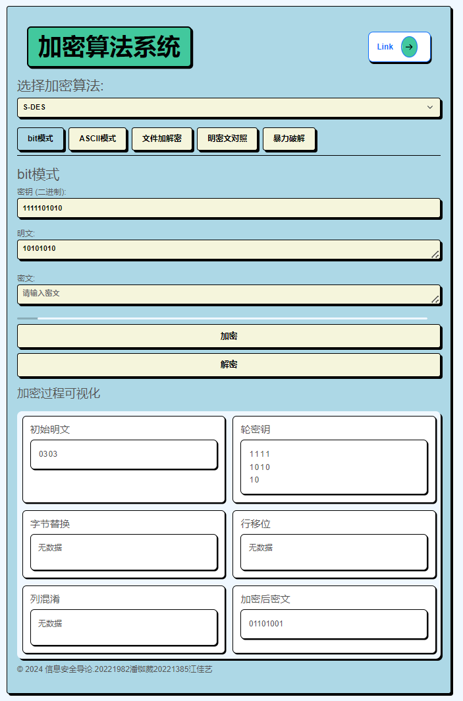
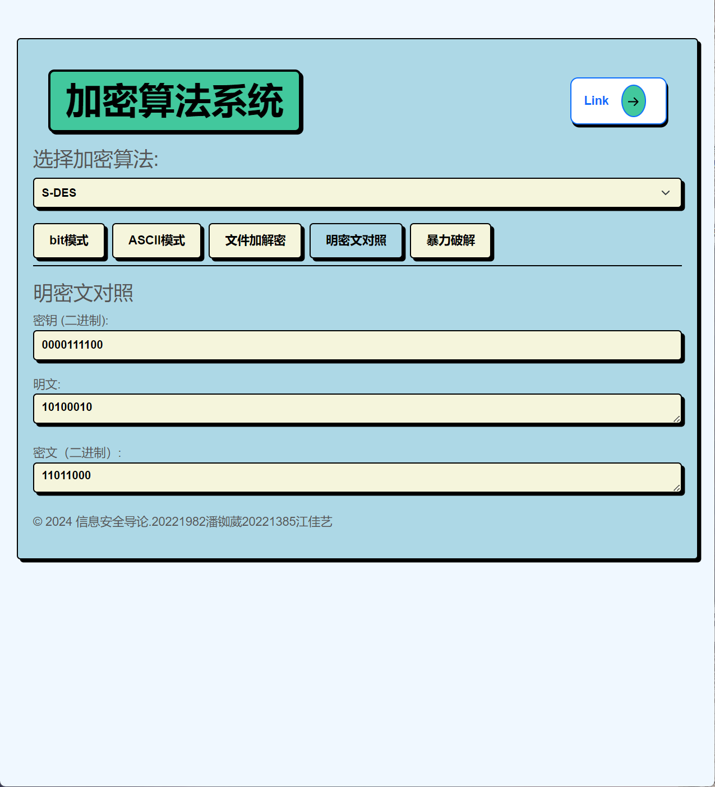
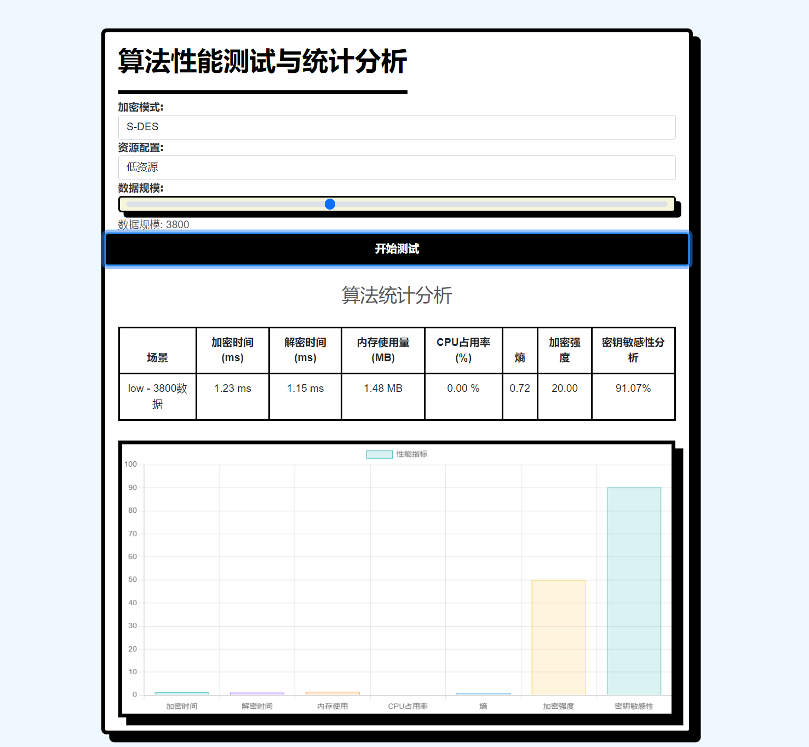

# Introduction-to-Information-Security

# 麦当劳随心配队（潘铷葳、江佳艺组）
本项目实现了简化版的 AES 和 DES 加密算法，并提供了性能测试、暴力破解和安全分析工具。该系统支持位模式和 ASCII 模式的加密/解密，还支持文件加密及暴力破解密钥的功能。
用户指南可见S-DES加解密系统-操作手册.pdf，快速掌握项目内容可直接下滑。

> 目录
- [测试报告](#测试报告)
  
  - [第一关 ：基本测试](#第一关-基本测试)
  
  - [第二关 ：交叉测试](#第二关-交叉测试)
  
  - [第三关：扩展功能](#第三关-扩展功能)
  
  - [第四关：暴力破解](#第四关-暴力破解)
  
  - [第五关：综合测试](#第五关-综合测试)
- [用户手册](#用户手册)
  - [项目概述](#项目概述)
  - [功能特性](#功能特性)
  - [安装步骤](#安装步骤)
  - [使用方法](#使用方法)
    - [加密与解密](#加密与解密)
    - [文件加密](#文件加密)
    - [暴力破解](#暴力破解)
    - [性能测试](#性能测试)
  - [API 接口](#api-接口)
  - [示例工作流](#示例工作流)
  - [技术栈](#技术栈)
  - [贡献者](#贡献者)
    
## 测试报告
### 第一关 基本测试

根据 S-DES 算法编写和调试程序，提供 **GUI** **解密**支持用户交互。输入可以是 8bit的数据和 10bit 的密钥，输出是 8bit 的密文。如果密钥的格式不正确(即不是 10bit 的二进制数)，则会给出如下提醒：


如果输入了合法的密钥，则可以输入明文二进制串，程序会自动将其转化为密文，如下所示：



如果输入了合法的密钥，则可以输入密文二进制串，程序会自动将其转化为明文，如下所示：


我们实现DES的基础上还实现了AES算法，并做了过程的可视化：


明文二进制串不限制位数，明文的输入 bit 数等于密文的输出 bit 数。由上可知，本程序提供了 **Web端** **解密**，支持用户交互，要求输入的密钥是 10 位二进制数，支持输入多位的明文，并自动给出对应的密文。满足基本测试的要求。

### 第二关 交叉测试

考虑到是**算法标准**，所有人在编写程序的时候需要使用相同算法流程和转换单元(P-Box、S-Box 等)，以保证算法和程序在异构的系统或平台上都可以正常运行。设有A 和 B 两组位同学(选择相同的密钥 K)；则 A、B 组同学编写的程序对明文 P 进行加密得到相同的密文 C；

加密：明文：10101010			密钥：1111101010

解密：密文：01101001			密钥：1111101010

荔枝组加解密结果：


**和我们第一关得到的结果一致，交叉测试通过。**

### 第三关 拓展功能

- ASCII模式：

  在 **ASCII模式** 下，用户可以输入由 ASCII 字符组成的明文和一个二进制格式的密钥来进行加密或解密操作。该模式允许用户直接输入可读字符（如字母、数字或符号）作为明文，系统会根据所选的加密算法（如 S-DES）对其进行加密处理。

  用户首先在输入框中填写一个 10 位的二进制密钥，然后在明文框中输入希望加密的 ASCII 字符串。点击 **“加密”** 按钮后，系统会使用指定的密钥对明文进行加密，并将生成的密文显示在结果框中。密文可能是一些特殊字符或不可见字符，这取决于加密算法的结果。

  同样，用户也可以在密文框中输入密文，并通过输入正确的密钥来解密该密文。点击 **“解密”** 按钮后，系统会解密输入的密文并显示解密得到的明文。

  **ASCII模式** 适合处理日常使用的文本数据，用户可以快速测试和验证加解密过程，同时也可以进行明文与密文的对比，了解加密算法对字符数据的处理方式。


- 文件加解密

  **文件加解密模式**允许用户通过输入二进制格式的密钥对文件进行加密和解密操作。用户可以选择本地文件并输入 10 位二进制密钥，然后点击“文件加密”按钮对文件内容进行加密，或点击“文件解密”按钮恢复加密文件的原始内容。加密或解密的结果会显示在界面下方，并且用户可以通过“保存文件”按钮将结果保存到本地。这一功能适用于对文件内容进行安全处理，确保文件在存储或传输过程中的保密性。


- 明密文对照

  在 **明密文对照** 模式下，页面提供了三个实时更新的输入框，分别用于输入二进制格式的密钥、明文和密文。用户可以输入密钥和明文，系统会自动计算并更新对应的密文；或者用户输入密钥和密文，系统会实时解密并显示对应的明文。这种实时更新的功能能够帮助用户快速进行加解密操作，同时方便验证明文与密文之间的对应关系，特别适合用于加解密算法的学习和测试。



- 算法性能测试

  在 **算法性能测试与统计分析** 页面中，用户可以选择加密算法、资源配置（如低资源、高资源）以及数据规模来进行加解密算法的性能测试。用户通过滑动条调节数据规模后，点击 **“开始测试”** 按钮，系统将基于选择的配置进行加解密操作，并实时显示测试结果。

  测试完成后，结果会展示在 **算法统计分析** 区域中。该区域提供了多个关键性能指标的统计信息，包括：
  - **加密时间**：加密过程所花费的时间（单位为毫秒）。
  - **解密时间**：解密过程所花费的时间（单位为毫秒）。
  - **内存使用量**：加解密过程中所占用的内存（单位为 MB）。
  - **CPU占用率**：加解密过程中的 CPU 使用百分比。
  - **加密强度**：对加密算法的强度评估。
  - **密钥敏感性分析**：算法对于密钥微小变动的敏感性百分比。

  下方还提供了性能图表，帮助用户直观了解加解密性能的对比与分析。这一功能适用于评估不同算法在不同硬件环境和数据规模下的表现，为用户优化算法选择提供依据。(该功能仍在完善)



### 第四关 暴力破解

在 **暴力破解** 模式下，用户不仅可以通过输入线程数量、明文和密文来执行暴力破解操作，还可以在破解过程中查看进度条。进度条会实时更新，显示破解任务的完成进度，帮助用户了解暴力破解过程的耗时和当前进展。

用户输入了明文 `1111111110` 和密文 `10011011`，并选择了使用 4 个线程来加快破解速度。点击 **“开始暴力破解”** 按钮后，进度条开始显示破解任务的实时进展。当所有可能的密钥都被尝试后，系统会展示找到的可能密钥以及每次尝试的结果。页面下方还会显示暴力破解完成所需的时间，比如本例中为 1.38 秒。

这种带有进度条的暴力破解功能让用户可以更直观地监控破解任务的执行状态，尤其是在处理较大规模数据或复杂密钥空间时，进度条可以有效提示任务的完成情况。

### 第五关 封闭测试

由第四关暴力破解的测试结果可知，对于明密文对，明文：`00110101`，密文：`11001101`，有四个不同的密钥 `1001010011`，`1010101010` 能造成这样的转化。

因此将这四个不同的密钥分别对同一个明文进行加密，观察其对应的密文是否有相同的，若相同，则说明对应明文空间任意给定的明文分组 ，会出现选择不同的密钥加密得到相同密文的情况。

测试结果如下：


对于不同的密钥 `1001010011` 和 `1010101010`，明文输入相同，加密得到相同的密文。

---
## 用户手册

### **项目概述**
本项目实现了以下两种简化版的加密算法：
- **S-AES (简化 AES)**
- **S-DES (简化 DES)**

项目的核心目标是评估这些加密算法在不同场景下的效率和安全性，包括暴力破解、加密强度分析、熵分析、密钥敏感性分析及加密/解密过程中的资源使用情况。

---

### **功能特性**
- 支持 **位模式和 ASCII 模式的加密/解密**，适用于 S-DES 和 S-AES。
- 支持 **文件加密/解密**，具有完善的错误处理和日志记录功能。
- 实现了 **多线程与多进程的暴力破解**，可用于破解 S-DES 和 S-AES 的密钥。
- 提供 **性能测试** 功能，分析 CPU 占用、内存消耗、加密时间、熵值、加密强度等多种性能指标。
- 基于 **Flask 和 WebSocket** 实现的实时交互界面，支持进度可视化。

---

### **安装步骤**

1. **克隆项目仓库**：
    ```bash
    git clone https://github.com/username/crypto-performance-bruteforce.git
    cd crypto-performance-bruteforce
    ```

2. **安装依赖包**：
    ```bash
    pip install -r requirements.txt
    ```

3. **启动 Flask 应用**：
    ```bash
    python app.py
    ```

---

### **使用方法**

#### **加密与解密**
1. **运行 Flask 服务器**，并在浏览器中访问 `http://localhost:5000`。
2. 选择 **位模式** 或 **ASCII 模式** 进行数据加密/解密操作，可以在页面上切换 S-DES 和 S-AES 加密算法。
3. 加密过程的可视化功能包括轮密钥、字节替换、行移位、列混淆等步骤。

#### **文件加密**
1. 在 **文件加解密** 部分上传需要加密或解密的 `.txt` 文件。
2. 输入二进制密钥，选择所需的加密模式。
3. 加密或解密结果将在页面上显示。

#### **暴力破解**
1. 在 **暴力破解** 部分，设置线程数量、明文和密文，并选择加密模式（S-DES 或 S-AES）。
2. 开始暴力破解，系统会实时显示破解进度，并显示找到的密钥。

#### **性能测试**
1. 在 **性能测试** 部分，选择数据规模和资源配置场景。
2. 运行测试以评估 CPU 使用率、内存消耗、加密/解密时间、密钥敏感性等性能指标。
3. 测试结果以表格和图表的形式展示。

---

### **API 接口**

| **方法** | **接口路径**        | **描述**                                              |
|----------|---------------------|-------------------------------------------------------|
| `POST`   | `/encrypt`           | 基于指定模式和密钥进行数据加密                         |
| `POST`   | `/decrypt`           | 基于指定模式和密钥进行数据解密                         |
| `POST`   | `/encrypt-file`      | 使用给定密钥和模式加密文件                             |
| `POST`   | `/decrypt-file`      | 使用给定密钥和模式解密文件                             |
| `POST`   | `/brute-force`       | 启动暴力破解密钥任务                                   |
| `POST`   | `/performance-test`  | 运行性能测试并返回统计结果                             |

---

### **示例工作流**

#### **位模式加密与解密（S-AES）**
```bash
curl -X POST http://localhost:5000/encrypt -H "Content-Type: application/json" \
-d '{
     "mode": "s-aes",
     "key": "1100101010111011",
     "plaintext": "1101001100110101"
    }'
```

#### **暴力破解 S-DES 密钥**
```bash
curl -X POST http://localhost:5000/brute-force -H "Content-Type: application/json" \
-d '{
     "threads": 4,
     "plaintext": "11010100",
     "ciphertext": "10011011",
     "mode": "s-des"
    }'
```

#### **性能测试**
```bash
curl -X POST http://localhost:5000/performance-test -H "Content-Type: application/json" \
-d '{
     "mode": "s-aes",
     "resource_config": "high",
     "data_size": 1000,
     "key": "1100101010111011",
     "plaintext": "1101001100110101"
    }'
```

---

### **技术栈**
- **Flask**：用于后端 API 和 Web 界面的开发。
- **Flask-SocketIO**：实现实时通信和进度更新。
- **Python 多进程与多线程**：用于并行执行暴力破解任务。
- **psutil**：用于系统资源监控和性能测试。
- **Chart.js**：用于性能数据的可视化展示。

---

### **贡献者**
- **[教师：胡海波]**
- **[潘铷葳]** 
- **[江佳艺]**


