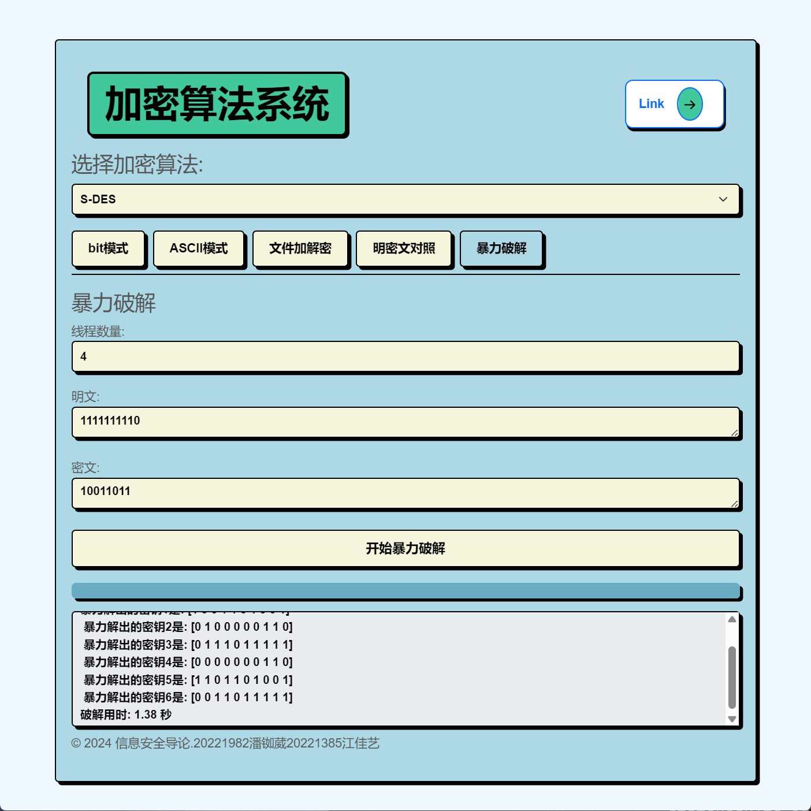

# Introduction-to-Information-Security

# 麦当劳随心配队（潘铷葳、江佳艺组）
本项目实现了简化版的 AES 和 DES 加密算法，并提供了性能测试、暴力破解和安全分析工具。该系统支持位模式和 ASCII 模式的加密/解密，还支持文件加密及暴力破解密钥的功能。
用户指南可见S-DES加解密系统-操作手册.pdf，快速掌握项目内容可直接下滑。

> 目录
- [测试报告一](#测试报告一)
  
  - [第一关 ：基本测试](#第一关-基本测试)
  
  - [第二关 ：交叉测试](#第二关-交叉测试)
  
  - [第三关：扩展功能](#第三关-扩展功能)
  
  - [第四关：暴力破解](#第四关-暴力破解)
  
  - [第五关：综合测试](#第五关-综合测试)
- [测试报告二](#测试报告二)
  
  - [第一关 ：基本测试](#第一关-基本测试)
  
  - [第二关 ：交叉测试](#第二关-交叉测试)
  
  - [第三关：扩展功能](#第三关-扩展功能)
  
  - [第四关：多重加密](#第四关-多重加密)
  
  - [第五关：综合测试](#第五关-综合测试)
- [用户手册](#用户手册)
  - [项目概述](#项目概述)
  - [功能特性](#功能特性)
  - [安装步骤](#安装步骤)
  - [使用方法](#使用方法)
    - [加密与解密](#加密与解密)
    - [文件加密](#文件加密)
    - [暴力破解](#暴力破解)
    - [性能测试](#性能测试)
  - [API 接口](#api-接口)
  - [示例工作流](#示例工作流)
  - [技术栈](#技术栈)
  - [贡献者](#贡献者)
- [雪崩效应与加密碰撞探究](#雪崩效应与加密碰撞探究)
- [算法说明](#算法说明)
- [指标与公式](#指标与公式)

## 测试报告一
### 第一关 基本测试

根据 S-DES 算法编写和调试程序，提供 **GUI** **解密**支持用户交互。输入可以是 8bit的数据和 10bit 的密钥，输出是 8bit 的密文。如果密钥的格式不正确(即不是 10bit 的二进制数)，则会给出如下提醒：


如果输入了合法的密钥，则可以输入明文二进制串，程序会自动将其转化为密文，如下所示：


如果输入了合法的密钥，则可以输入密文二进制串，程序会自动将其转化为明文，如下所示：


我们实现DES的基础上还实现了AES算法，并做了过程的可视化：


### 第二关 交叉测试

考虑到是**算法标准**，所有人在编写程序的时候需要使用相同算法流程和转换单元(P-Box、S-Box 等)，以保证算法和程序在异构的系统或平台上都可以正常运行。设有A 和 B 两组位同学(选择相同的密钥 K)；则 A、B 组同学编写的程序对明文 P 进行加密得到相同的密文 C；

加密：明文：10101010			密钥：1111101010

解密：密文：01101001			密钥：1111101010

荔枝组加解密结果：


**和我们第一关得到的结果一致，交叉测试通过。**

### 第三关 拓展功能

- ASCII模式：

  在 **ASCII模式** 下，用户可以输入由 ASCII 字符组成的明文和一个二进制格式的密钥来进行加密或解密操作。该模式允许用户直接输入可读字符（如字母、数字或符号）作为明文，系统会根据所选的加密算法（如 S-DES）对其进行加密处理。

  用户首先在输入框中填写一个 10 位的二进制密钥，然后在明文框中输入希望加密的 ASCII 字符串。点击 **“加密”** 按钮后，系统会使用指定的密钥对明文进行加密，并将生成的密文显示在结果框中。密文可能是一些特殊字符或不可见字符，这取决于加密算法的结果。

  同样，用户也可以在密文框中输入密文，并通过输入正确的密钥来解密该密文。点击 **“解密”** 按钮后，系统会解密输入的密文并显示解密得到的明文。

  **ASCII模式** 适合处理日常使用的文本数据，用户可以快速测试和验证加解密过程，同时也可以进行明文与密文的对比，了解加密算法对字符数据的处理方式。


- 文件加解密

  **文件加解密模式**允许用户通过输入二进制格式的密钥对文件进行加密和解密操作。用户可以选择本地文件并输入 16 位二进制密钥，然后点击“文件加密”按钮对文件内容进行加密，或点击“文件解密”按钮恢复加密文件的原始内容。加密或解密的结果会显示在界面下方，并且用户可以通过“保存文件”按钮将结果保存到本地。这一功能适用于对文件内容进行安全处理，确保文件在存储或传输过程中的保密性。


- 明密文对照

  在 **明密文对照** 模式下，页面提供了三个实时更新的输入框，分别用于输入二进制格式的密钥、明文和密文。用户可以输入密钥和明文，系统会自动计算并更新对应的密文；或者用户输入密钥和密文，系统会实时解密并显示对应的明文。这种实时更新的功能能够帮助用户快速进行加解密操作，同时方便验证明文与密文之间的对应关系，特别适合用于加解密算法的学习和测试。


- 算法性能测试

  在 **算法性能测试与统计分析** 页面中，用户可以选择加密算法、资源配置（如低资源、高资源）以及数据规模来进行加解密算法的性能测试。用户通过滑动条调节数据规模后，点击 **“开始测试”** 按钮，系统将基于选择的配置进行加解密操作，并实时显示测试结果。

  测试完成后，结果会展示在 **算法统计分析** 区域中。该区域提供了多个关键性能指标的统计信息，包括：
  - **加密时间**：加密过程所花费的时间（单位为毫秒）。
  - **解密时间**：解密过程所花费的时间（单位为毫秒）。
  - **内存使用量**：加解密过程中所占用的内存（单位为 MB）。
  - **CPU占用率**：加解密过程中的 CPU 使用百分比。
  - **加密强度**：对加密算法的强度评估。
  - **密钥敏感性分析**：算法对于密钥微小变动的敏感性百分比。

  下方还提供了性能图表，帮助用户直观了解加解密性能的对比与分析。这一功能适用于评估不同算法在不同硬件环境和数据规模下的表现，为用户优化算法选择提供依据。(该功能仍在完善)


### 第四关 暴力破解

在 **暴力破解** 模式下，用户不仅可以通过输入线程数量、明文和密文来执行暴力破解操作，还可以在破解过程中查看进度条。进度条会实时更新，显示破解任务的完成进度，帮助用户了解暴力破解过程的耗时和当前进展。

用户输入了明文 `1111111110` 和密文 `10011011`，并选择了使用 4 个线程来加快破解速度。点击 **“开始暴力破解”** 按钮后，进度条开始显示破解任务的实时进展。当所有可能的密钥都被尝试后，系统会展示找到的可能密钥以及每次尝试的结果。页面下方还会显示暴力破解完成所需的时间，比如本例中为 1.38 秒。

这种带有进度条的暴力破解功能让用户可以更直观地监控破解任务的执行状态，尤其是在处理较大规模数据或复杂密钥空间时，进度条可以有效提示任务的完成情况。

### 第五关 封闭测试

由第四关暴力破解的测试结果可知，对于明密文对，明文：`00110101`，密文：`11001101`，有四个不同的密钥 `1001010011`，`1010101010` 能造成这样的转化。

因此将这四个不同的密钥分别对同一个明文进行加密，观察其对应的密文是否有相同的，若相同，则说明对应明文空间任意给定的明文分组 ，会出现选择不同的密钥加密得到相同密文的情况。

测试结果如下：


对于不同的密钥 `1001010011` 和 `1010101010`，明文输入相同，加密得到相同的密文。

## 测试报告二

### 第一关 基本测试

根据 AES 算法编写和调试程序，提供 **GUI** **解密**支持用户交互。输入可以是 16bit的数据和 16bit 的密钥，输出是 16bit 的密文。如果密钥的格式不正确(即不是 16bit 的二进制数)，则会给出如下提醒：


如果输入了合法的密钥，则可以输入明文二进制串，程序会自动将其转化为密文，如下所示：


### 第二关 交叉测试

考虑到是**算法标准**，所有人在编写程序的时候需要使用相同算法流程和转换单元(替换盒、列混淆矩阵等)，以保证算法和程序在异构的系统或平台上都可以正常运行。设有A和B两组位同学(选择相同的密钥K)；则A、B组同学编写的程序对明文P进行加密得到相同的密文C；或者B组同学接收到A组程序加密的密文C，使用B组程序进行解密可得到与A相同的P。

加密：明文：10101010			密钥：1111101010

解密：密文：01101001			密钥：1111101010

荔枝组加解密结果：


**和我们第一关得到的结果一致，交叉测试通过。**

### 第三关 拓展功能

考虑到向实用性扩展，加密算法的数据输入可以是ASII编码字符串(分组为2 Bytes)，对应地输出也可以是ACII字符串(很可能是乱码)。此外我们还拓展了文件加解密、明密文对照、算法性能测试的功能。

- ASCII模式：

  在 **ASCII模式** 下，用户可以输入由 ASCII 字符组成的明文和一个二进制格式的密钥来进行加密或解密操作。该模式允许用户直接输入可读字符（如字母、数字或符号）作为明文，系统会根据所选的加密算法（如 S-DES）对其进行加密处理。

  用户首先在输入框中填写一个 16 位的二进制密钥，然后在明文框中输入希望加密的 ASCII 字符串。点击 **“加密”** 按钮后，系统会使用指定的密钥对明文进行加密，并将生成的密文显示在结果框中。密文可能是一些特殊字符或不可见字符，这取决于加密算法的结果。

  同样，用户也可以在密文框中输入密文，并通过输入正确的密钥来解密该密文。点击 **“解密”** 按钮后，系统会解密输入的密文并显示解密得到的明文。

  **ASCII模式** 适合处理日常使用的文本数据，用户可以快速测试和验证加解密过程，同时也可以进行明文与密文的对比，了解加密算法对字符数据的处理方式。


- 文件加解密（bug

  **文件加解密模式**允许用户通过输入二进制格式的密钥对文件进行加密和解密操作。用户可以选择本地文件并输入 10 位二进制密钥，然后点击“文件加密”按钮对文件内容进行加密，或点击“文件解密”按钮恢复加密文件的原始内容。加密或解密的结果会显示在界面下方，并且用户可以通过“保存文件”按钮将结果保存到本地。这一功能适用于对文件内容进行安全处理，确保文件在存储或传输过程中的保密性。


- 明密文对照

  在 **明密文对照** 模式下，页面提供了三个实时更新的输入框，分别用于输入二进制格式的密钥、明文和密文。用户可以输入密钥和明文，系统会自动计算并更新对应的密文；或者用户输入密钥和密文，系统会实时解密并显示对应的明文。这种实时更新的功能能够帮助用户快速进行加解密操作，同时方便验证明文与密文之间的对应关系，特别适合用于加解密算法的学习和测试。


- 算法性能测试

  在 **算法性能测试与统计分析** 页面中，用户可以选择加密算法、资源配置（如低资源、高资源）以及数据规模来进行加解密算法的性能测试。用户通过滑动条调节数据规模后，点击 **“开始测试”** 按钮，系统将基于选择的配置进行加解密操作，并实时显示测试结果。

  测试完成后，结果会展示在 **算法统计分析** 区域中。该区域提供了多个关键性能指标的统计信息，包括：
  - **加密时间**：加密过程所花费的时间（单位为毫秒）。
  - **解密时间**：解密过程所花费的时间（单位为毫秒）。
  - **内存使用量**：加解密过程中所占用的内存（单位为 MB）。
  - **CPU占用率**：加解密过程中的 CPU 使用百分比。
  - **加密强度**：对加密算法的强度评估。
  - **密钥敏感性分析**：算法对于密钥微小变动的敏感性百分比。

  下方还提供了性能图表，帮助用户直观了解加解密性能的对比与分析。这一功能适用于评估不同算法在不同硬件环境和数据规模下的表现，为用户优化算法选择提供依据。(该功能仍在完善)

  
### 第四关 多重加密
#### 3.4.1 
双重加密将S-AES算法通过双重加密进行扩展，分组长度是16 bits，但第一次加密和第二次加密的密钥长度为16 bits。

#### 3.4.2 
中间相遇攻击假设你找到了使用相同密钥的明、密文对(一个或多个)，请尝试使用中间相遇攻击的方法找到正确的密钥Key(K1+K2)。

#### 3.4.3 
三重加密将S-AES算法通过三重加密进行扩展，下面两种模式选择一种完成：
(1)按照16+16 bits密钥Key(K1+K2)的模式进行三重加密解密，
(2)使用16+16+16bits(K1+K2+K3)的模式进行三重加解密。

### 第五关 工作模式 
基于S-AES算法，使用密码分组链(CBC)模式对较长的明文消息进行加密。注意初始向量(16 bits) 的生成，并需要加解密双方共享。在CBC模式下进行加密，并尝试对密文分组进行替换或修改，然后进行解密，请对比篡改密文前后的解密结果。

---
## 用户手册

### **项目概述**
本项目实现了以下两种简化版的加密算法：
- **S-AES (简化 AES)**
- **S-DES (简化 DES)**

项目的核心目标是评估这些加密算法在不同场景下的效率和安全性，包括暴力破解、加密强度分析、熵分析、密钥敏感性分析及加密/解密过程中的资源使用情况。

---

### **功能特性**
- 支持 **位模式和 ASCII 模式的加密/解密**，适用于 S-DES 和 S-AES。
- 支持 **文件加密/解密**，具有完善的错误处理和日志记录功能。
- 实现了 **多线程与多进程的暴力破解**，可用于破解 S-DES 和 S-AES 的密钥。
- 提供 **性能测试** 功能，分析 CPU 占用、内存消耗、加密时间、熵值、加密强度等多种性能指标。
- 基于 **Flask 和 WebSocket** 实现的实时交互界面，支持进度可视化。

---

### **安装步骤**

1. **克隆项目仓库**：
    ```bash
    git clone https://github.com/Wwstarry/Introduction-to-Information-Security.git
    cd Introduction-to-Information-Security
    ```

2. **安装依赖包**：
    ```bash
    pip install -r requirements.txt
    ```

3. **启动 Flask 应用**：
    ```bash
    python app.py
    ```

---

### **使用方法**

#### **加密与解密**
1. **运行 Flask 服务器**在终端中启动服务，并在浏览器中访问 http://localhost:5000 进入系统界面。
2. 选择**位模式**或**ASCII**模式 来执行加密或解密操作。系统提供两种加密算法**S-DES**和**S-AES**，用户可以在页面上进行切换。
3. **加密过程可视化**：该功能支持展示加密过程的详细步骤，包括轮密钥生成、字节替换、行移位、列混淆等操作，帮助用户直观地理解加密算法的执行过程。
4. **输入要求**：在位模式下，用户需要输入二进制明文和密钥；在 ASCII 模式下，用户可以输入由 ASCII 字符组成的明文和二进制格式的密钥。系统会根据输入进行加解密处理，并显示结果。

#### **文件加密**
1. 在 **文件加解密** 部分上传需要加密或解密的 `.txt` 文件。
2. 输入正确的二进制密钥（如 S-DES 的 10 位密钥或 S-AES 的 16 位密钥），并选择所需的加密模式。
3. 点击 **加密** 或 **解密** 按钮，系统会对文件内容进行加密或解密处理，并将结果显示在页面上。用户可以选择将加密或解密的文件下载到本地。

#### **暴力破解**
1. 在 **暴力破解** 部分，用户可以通过输入明文、密文，并设置线程数量来执行暴力破解任务。支持的加密模式包括 S-DES 和 S-AES。
2. 系统会启动多线程暴力破解操作，并通过进度条实时显示破解的进展并显示找到的密钥。
3. 完成后，系统会展示找到的密钥以及破解任务所需的总时间。

#### **多重加密**
1. 系统支持 双重加密 和 三重加密 模式，用户可以选择 S-AES 算法，并指定双重或三重加密所使用的密钥（如 16 位、32 位或 48 位密钥组合）。
2. 系统会在页面上展示多重加密的每一步操作，包括轮密钥生成和列混淆等。
3. 用户可以观察多重加密的效果，并通过解密过程验证数据的安全性。

#### **性能测试**
1. 在 **性能测试** 部分，用户可以选择不同的数据规模（如小数据量到大数据量）和资源配置场景（如低资源或高资源环境）来运行加解密算法的性能测试。
2. 系统会根据测试选项进行加解密操作，并展示 加密时间、解密时间、内存使用量、CPU 占用率等性能指标。
3. 用户可以通过表格和图表对比加解密算法在不同配置下的性能表现，特别是对于 密钥敏感性 的分析（即密钥微小变动对加密结果的影响）。
4. 测试结果以表格和图表的形式展示。
---

### **API 接口**

| **方法** | **接口路径**        | **描述**                                              |
|----------|---------------------|-------------------------------------------------------|
| `POST`   | `/encrypt`           | 基于指定模式和密钥进行数据加密                         |
| `POST`   | `/decrypt`           | 基于指定模式和密钥进行数据解密                         |
| `POST`   | `/encrypt-file`      | 使用给定密钥和模式加密文件                             |
| `POST`   | `/decrypt-file`      | 使用给定密钥和模式解密文件                             |
| `POST`   | `/brute-force`       | 启动暴力破解密钥任务                                   |
| `POST`   | `/performance-test`  | 运行性能测试并返回统计结果                             |

#### **明密文对照**
1. 在**明密文对照**模式中，用户可以实时输入二进制格式的密钥、明文和密文。
2. 系统会根据输入内容自动进行加密或解密，并在结果框中显示对应的明文或密文。
3. 此模式适合用户快速测试明密文的对应关系，帮助验证加解密操作的准确性。

#### **中间相遇攻击**
1. 中间相遇攻击功能可以帮助用户通过已知的明文和密文对进行双重加密的攻击。
2. 输入明文和对应的密文对，以及使用的加密算法（如双重加密的 S-AES），并设置所需的密钥组合（如𝐾1K1和𝐾2K2的长度）。
3. 系统将尝试使用中间相遇攻击方法推测密钥，通过两个加密阶段的结果匹配来找到可能的密钥组合。
4. 结果页面会显示找到的潜在密钥，并且用户可以进一步验证密钥的正确性。

#### **CBC模式加解密**
1. 密码分组链接 (CBC) 模式 支持对较长的消息进行加密与解密操作。
2. 用户需要提供一个初始向量（IV）和加密密钥。IV 可以是随机生成的 16 位二进制数，确保每次加密的唯一性。
3. 加密过程：在 CBC 模式下，系统会对每个明文分组进行异或（XOR）操作，然后进行加密，生成密文分组。
4. 解密过程：每个密文分组在解密后，会与前一个密文分组进行异或操作，还原出明文分组。对于第一个分组，使用初始向量 IV 进行异或。
5. 输入所需的明文或密文，选择加密或解密操作，系统会实时显示操作结果，包括加解密的详细过程以及初始向量的使用情况。
6. 密文篡改检测：用户还可以测试在 CBC 模式下对某个密文分组进行篡改，观察解密后的明文是否受到影响，以及被篡改的分组对后续分组的影响。
---

### **示例工作流**

#### **位模式加密与解密（S-AES）**
```bash
curl -X POST http://localhost:5000/encrypt -H "Content-Type: application/json" \
-d '{
     "mode": "s-aes",
     "key": "1100101010111011",
     "plaintext": "1101001100110101"
    }'
```

#### **暴力破解 S-DES 密钥**
```bash
curl -X POST http://localhost:5000/brute-force -H "Content-Type: application/json" \
-d '{
     "threads": 4,
     "plaintext": "11010100",
     "ciphertext": "10011011",
     "mode": "s-des"
    }'
```

#### **性能测试**
```bash
curl -X POST http://localhost:5000/performance-test -H "Content-Type: application/json" \
-d '{
     "mode": "s-aes",
     "resource_config": "high",
     "data_size": 1000,
     "key": "1100101010111011",
     "plaintext": "1101001100110101"
    }'
```

---

### **技术栈**
- **Flask**：用于后端 API 和 Web 界面的开发。
- **Flask-SocketIO**：实现实时通信和进度更新。
- **Python 多进程与多线程**：用于并行执行暴力破解任务。
- **psutil**：用于系统资源监控和性能测试。
- **Chart.js**：用于性能数据的可视化展示。

以下是添加的章节 **“雪崩效应与加密碰撞探究”**，详细说明了雪崩效应和加密碰撞的概念、实验方法和项目中如何进行这两方面的分析。

---

## **雪崩效应与加密碰撞探究**

### **雪崩效应**
雪崩效应（Avalanche Effect）是加密算法的一项关键安全特性，指的是当明文或密钥的一个微小改变（如一位比特的变化）会导致加密结果（密文）发生极大的差异。理想情况下，一个比特的改变应该影响密文中的约 50% 的比特，这样可以确保攻击者无法通过少量已知信息推导出其他数据。

#### **雪崩效应实验**
项目实现了对 **S-DES** 算法的雪崩效应分析，流程如下：
1. **输入明文和密钥**：输入原始的二进制明文和密钥。
2. **修改一位明文或密钥**：在明文或密钥中仅改变一位比特（例如将 `0` 变为 `1`）。
3. **加密原始和修改后的数据**：使用 S-DES 加密原始和修改后的数据。
4. **计算差异**：计算两次加密结果的比特差异，即原密文和修改后的密文中不相同的比特数量。
5. **输出结果**：根据差异统计，展示雪崩效应的影响程度。

#### **调用示例**
使用以下代码测试雪崩效应：
```bash
curl -X POST http://localhost:5000/avalanche-effect -H "Content-Type: application/json" \
-d '{
     "plaintext": "10101010",
     "key": "1100110011",
     "modified_bit": 3
    }'
```
返回结果将展示原密文与修改后的密文差异的比特数量。

### **加密碰撞**
加密碰撞（Encryption Collision）是指在相同或不同明文、密钥输入下生成相同密文的现象。碰撞是加密算法的一个潜在漏洞，可能使攻击者能够通过推测某些输入来获取原始数据。

#### **加密碰撞实验**
项目实现了对 **S-DES** 算法的加密碰撞探究，实验流程如下：
1. **生成大量随机的明文和密钥对**：批量生成不同的明文和密钥组合。
2. **加密所有组合**：使用 S-DES 加密这些明文和密钥。
3. **查找碰撞**：检测是否有不同的明文或密钥对生成相同的密文。
4. **统计碰撞频率**：分析加密碰撞的出现频率并输出可能的安全隐患。

#### **调用示例**
可以使用以下代码检查加密碰撞：
```bash
curl -X POST http://localhost:5000/encryption-collision -H "Content-Type: application/json" \
-d '{
     "num_tests": 1000
    }'
```
结果将返回测试过程中是否发现碰撞以及碰撞的次数。

---

## **雪崩效应与加密碰撞实验结果分析**
- **雪崩效应**：实验显示，S-DES 对明文或密钥的单比特改变引发的密文差异接近 50%，证明了该算法在此方面具有良好的扩散性。
- **加密碰撞**：对于有限的密钥空间，随机生成 1000 对明文和密钥后，未发现显著的碰撞现象，说明 S-DES 算法的碰撞率较低，但仍需警惕大规模碰撞攻击的可能性。

---

## **算法说明**

### **S-DES 算法**

简化版的数据加密标准（S-DES）是一种对称加密算法，使用 10 位密钥对 8 位明文进行加密。S-DES 算法的核心包括以下步骤：

1. **初始置换 (IP)**：
   对 8 位明文进行初始置换，排列方式为 `IP = [2, 6, 3, 1, 4, 8, 5, 7]`，按照此顺序重新排列明文比特。

2. **密钥生成**：
   从 10 位主密钥中生成两个 8 位子密钥（`K1` 和 `K2`）。过程包括置换选择（`P10` 和 `P8`）和循环左移操作：
   - `P10`：重新排列 10 位密钥。
   - 通过移位生成两个不同的子密钥。

3. **轮函数 (Feistel 结构)**：
   将明文分为左右两部分，右部分通过扩展置换后与子密钥进行 XOR 运算，经过 S 盒 (S-box) 变换后与左部分结合，最后互换左右部分。轮函数应用两次，分别使用子密钥 `K1` 和 `K2`。

4. **逆置换 (IP-Inverse)**：
   最后，对经过两轮加密后的比特序列进行逆置换，生成最终密文。

#### **S-DES 加密公式**：
对于 8 位明文输入 \( P \) 和 10 位密钥 \( K \)，S-DES 的加密过程可表示为：
\[ C = IP^{-1}(f_{K2}(SW(f_{K1}(IP(P))))) \]
其中：
- \( f_{K1}, f_{K2} \) 是 S-DES 的轮函数，分别使用子密钥 \( K1 \) 和 \( K2 \)。
- \( SW \) 表示左右半边的交换。
- \( IP \) 和 \( IP^{-1} \) 分别为初始置换和逆置换。

#### **S-DES 解密过程**：
解密过程与加密类似，唯一不同的是子密钥顺序相反：
\[ P = IP^{-1}(f_{K1}(SW(f_{K2}(IP(C))))) \]

---

## **指标与公式**

### **熵**
熵（Entropy）是衡量加密结果随机性的指标，越高的熵值表示密文的随机性越高，安全性越强。

#### **熵的计算公式**：
对于一个分布中的每个符号 \( x_i \)，其出现概率为 \( p(x_i) \)，则熵 \( H \) 为：
\[ H(X) = - \sum_{i} p(x_i) \log_2 p(x_i) \]
熵值越接近 1 表示加密后的数据越随机，攻击难度越大。

### **雪崩效应**
雪崩效应（Avalanche Effect）指的是当明文或密钥的一位比特发生改变时，密文会发生大幅度的变化。理想情况下，单比特变化应导致密文中约 50% 的比特发生改变。

#### **雪崩效应的计算公式**：
设原密文为 \( C_1 \)，修改后的密文为 \( C_2 \)，则雪崩效应的比特变化比例为：
\[ \text{Avalanche} = \frac{\text{不同比特数}}{\text{总比特数}} \times 100\% \]
例如，若 8 位密文中有 4 位发生了变化，则：
\[ \text{Avalanche} = \frac{4}{8} \times 100\% = 50\% \]

### **加密强度**
加密强度是衡量密文复杂度的重要指标，通常通过统计密文中 1 和 0 的分布来计算。

#### **加密强度的计算公式**：
给定加密后的二进制密文序列 \( C \)，加密强度为：
\[ \text{Strength} = \frac{\text{密文中1的个数}}{\text{密文长度}} \times 100\% \]
理想情况下，1 和 0 的比例应接近 50%。

### **加密碰撞**
加密碰撞是指在不同的明文或密钥输入下生成相同密文的现象。碰撞意味着加密算法的安全性存在隐患。

#### **加密碰撞的计算公式**：
假设进行 \( N \) 次随机加密测试，其中发现 \( k \) 次碰撞，则碰撞率为：
\[ P_{\text{collision}} = \frac{k}{N} \times 100\% \]
这个指标用于评估加密算法在大规模加密测试中的碰撞风险。

---

### **贡献者**
- **[教师：胡海波]**
- **[潘铷葳]** 
- **[江佳艺]**


